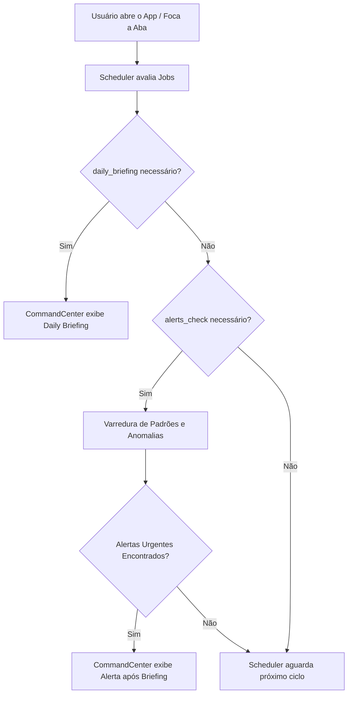

# Checkpoint Técnico — Fase 4 Concluída: Proatividade e Contexto no Aion

Este documento registra o estado técnico final da **Fase 4 (Aion Proativo e Memória de Sessão)** do Córtex Operacional, validando a conclusão das implementações e preparando o terreno para a próxima fase de **Presença e JARVIS Visual**.

---

## 1. Resumo Executivo

Durante a Fase 4, a inteligência do Aion foi expandida de um modelo reativo (que apenas responde sob demanda) para um sistema com **proatividade agendada** e **consciência situacional de curto prazo**. O Aion agora é capaz de analisar de forma autônoma os dados locais do usuário em segundo plano, gerar briefings diários automáticos, alertá-lo sobre anomalias ou metas em risco, e manter o contexto completo das mensagens trocadas na sessão atual. 

Toda a arquitetura foi desenvolvida respeitando as restrições de rodar inteiramente no navegador (SSR-safe), sem dependência inicial de Tauri, push notifications externas ou banco de dados remoto (Supabase).

---

## 2. O que foi Implementado

### A. Daily Briefing Automático (`lib/dailyBriefing.ts`)
- **shouldShowBriefing()**: Determina se o briefing do dia atual já foi exibido, prevenindo interrupções repetidas usando `localStorage`.
- **generateBriefing()**: Consolida o estado da agenda do usuário (tarefas pendentes, streak de hábitos, gastos totais no dia) e gera um resumo motivacional e estratégico adaptado ao contexto de ADHD.
- **markBriefingShown()**: Registra o timestamp da última exibição do dia.

### B. Alertas Proativos (`lib/aionAlerts.ts`)
- Sistema local de varredura que detecta 5 tipos principais de padrões/anomalias:
  - `FINANCEIRO_ALTO`: Gastos diários excedendo 150% da média histórica.
  - `HABITO_ABANDONADO`: Hábitos recorrentes sem marcação ativa nos últimos $X$ dias.
  - `PROJETO_INATIVO`: Projetos sem anotações ou tarefas editadas por mais de 7 dias.
  - `TAREFA_VENCENDO`: Tarefas com prazo de conclusão (`dueDate`) inferior a 24 horas.
  - `PADRAO_POSITIVO`: Streaks de hábitos recordes, conclusão de metas ou tarefas de alta prioridade.
- Mecanismo de expurgo histórico de alertas antigos (limpeza automática após 7 dias).

### C. Browser Scheduler Layer (`lib/aionScheduler.ts`)
- Agendador leve executado no loop de eventos do navegador.
- Gerencia 5 tarefas com intervalos de recorrência customizados (ex: 2h, 24h):
  - `pattern_analysis` (análise de padrões)
  - `daily_briefing` (briefing matinal)
  - `alerts_check` (varredura de alertas locais)
  - `clear_old_alerts` (purga de alertas antigos)
  - `semantic_maintenance` (otimização e indexação semântica)
- Resiliente a falhas individuais e SSR-safe (não quebra no lado do servidor Next.js).

### D. Memória de Sessão de Curto Prazo (`lib/sessionMemory.ts`)
- Buffer leve local com limite máximo de 20 mensagens (cap infinito automático).
- **buildSessionContext()**: Extrai as últimas 10 mensagens (5 interações completas usuário/Aion) e formata-as como um bloco estruturado injetado no prompt de contexto do LLM.
- **summarizeSession()**: Gera resumos heurísticos rápidos locais (sem custos extras de LLM) do progresso da sessão para gravação local persistente.

---

## 3. Como o Aion Ficou Proativo

A proatividade do Aion funciona por meio de um pipeline cíclico de avaliação:

1. Quando o `CommandCenter` é montado, o agendador executa as verificações programadas.
2. Caso o briefing do dia ainda não tenha sido exibido, ele é gerado e mostrado em destaque na UI.
3. Em seguida, o `alerts_check` faz a varredura do banco local (Dexie/LocalStorage). Se forem detectados desvios (como gastos exorbitantes ou tarefas críticas vencendo), alertas de prioridade `high` ou `medium` são mostrados imediatamente na tela após o briefing.

---

## 4. Como o Scheduler Funciona no Browser

O scheduler opera sem processos pesados em background de sistema operacional (como Tauri sidecars ou Cron jobs de servidor). Ele utiliza a API nativa de visibilidade do navegador:

- **Visibility Handler**: Escuta o evento `visibilitychange`. Sempre que o usuário foca a aba do Córtex (`document.visibilityState === "visible"`), o scheduler reavalia quais tarefas estão com o tempo de intervalo esgotado.
- **LocalStorage Sync**: As datas de última execução de cada tarefa (`lastRun`) são persistidas no `localStorage`. Isso assegura sincronização mesmo se o usuário abrir o app em múltiplas abas.
- **Isolamento de Erros**: Cada job é executado dentro de blocos `try/catch` independentes. A falha de uma manutenção semântica, por exemplo, não impede a análise de alertas ou a exibição do briefing diário.

---

## 5. Como a Memória de Sessão Entra no Contexto

A memória de curto prazo garante coesão conversacional sem inchar o tamanho da janela de contexto do LLM. O fluxo de injeção é o seguinte:

1. **Captura**:
   - Mensagem enviada pelo usuário $\rightarrow$ `addToSession("user", message)`.
   - Resposta do Aion $\rightarrow$ `addToSession("aion", reply)`.
2. **Transferência**:
   - `CommandCenter` anexa o histórico recente (`getRecentSessionMessages(10)`) na requisição POST de `/api/aion`.
3. **Reasoning Pipeline**:
   - A rota de API repassa o histórico de mensagens para a função `runAgent()`.
   - O pipeline de raciocínio (`llmPipeline` em `lib/aionReason.ts`) atribui essas mensagens à propriedade `recentSessionMessages` do objeto de contexto `AionContext`.
4. **Prompt Builder**:
   - A função `buildQueryPrompt()` do `lib/aionContext.ts` formata esse histórico como um bloco estruturado (`CONVERSA RECENTE DA SESSÃO:\n...`) e o injeta antes da mensagem atual do usuário, dando contexto completo ao LLM.

---

## 6. O que Ainda Não Foi Implementado (Fases Futuras)

Para fins de simplicidade e confiabilidade no estágio atual de web-app, os seguintes recursos foram postergados:
- **Tauri Scheduler**: Agendamento nativo do lado do desktop OS em Rust (ainda sem código em `src-tauri`).
- **Notificações Nativas do SO / Push Notifications**: O Aion atualmente se comunica apenas através da interface visual interna do `CommandCenter`.
- **UI Avançada de Alertas**: Exibição dos alertas em cards visuais dedicados (hoje integrados no console de texto principal do Aion).

---

## 7. Testes Existentes e Cobertura

Uma suite completa de testes automatizados valida todos os fluxos críticos da Fase 4:

| Arquivo de Teste | Funcionalidade Testada | Quantidade |
| :--- | :--- | :---: |
| `dailyBriefing.test.ts` | Regras de exibição de briefing, expiração diária, geração estruturada. | 14 testes |
| `aionAlerts.test.ts` | Detecção de anomalia financeira, abandono de hábitos, tarefas vencendo, e expurgo histórico. | 9 testes |
| `aionScheduler.test.ts` | Intervalos de jobs, idempotência do localStorage, tolerância a falhas de execução. | 8 testes |
| `sessionMemory.test.ts` | Limite rígido de 20 mensagens, formatação de contexto de 10 mensagens, resumos e SSR-safety. | 6 testes |
| `CommandCenter.test.ts` | Renderização não bloqueante, tolerância a falhas na inicialização do scheduler ou alertas. | 3 testes |

**Total da suite**: 389/389 testes passando com sucesso.

---

## 8. Riscos Atuais

- **Tamanho do Contexto do LocalStorage**: Se muitos dados de histórico de mensagens (metadados complexos) forem acumulados, o limite de 5MB do `localStorage`/`sessionStorage` pode ser afetado se o sistema for estendido incorretamente. *(Mitigação: o cap de 20 mensagens mantém a pegada de memória abaixo de 10KB).*
- **Mudança de Fuso Horário**: A detecção de "novo dia" para o daily briefing depende do relógio do cliente (`new Date()`). Viagens de fuso horário podem causar dupla exibição ou atraso de briefing.

---

## 9. Pendências Futuras

- Migrar a execução do Scheduler do browser para o Tauri (`rust-scheduler` em background) quando a aplicação desktop for empacotada.
- Criar canais de notificações locais do sistema operacional (usando a API de notificações do Tauri ou Web Notification API).
- Desenvolver um painel visual expansível na barra lateral para listagem e descarte interativo dos alertas inativos do Aion.

---

## 10. Critérios de Aceitação da Fase 4

A Fase 4 é considerada **formalmente concluída** sob as seguintes métricas:
1. Geração de briefings diários sem repetição no mesmo dia $\rightarrow$ **Verificado**.
2. Varreduras automáticas de anomalias com alertas exibidos no mount do CommandCenter $\rightarrow$ **Verificado**.
3. O Aion lembra e reage a informações passadas na mesma sessão $\rightarrow$ **Verificado**.
4. 100% dos testes unitários verdes e build estável $\rightarrow$ **Verificado**.
