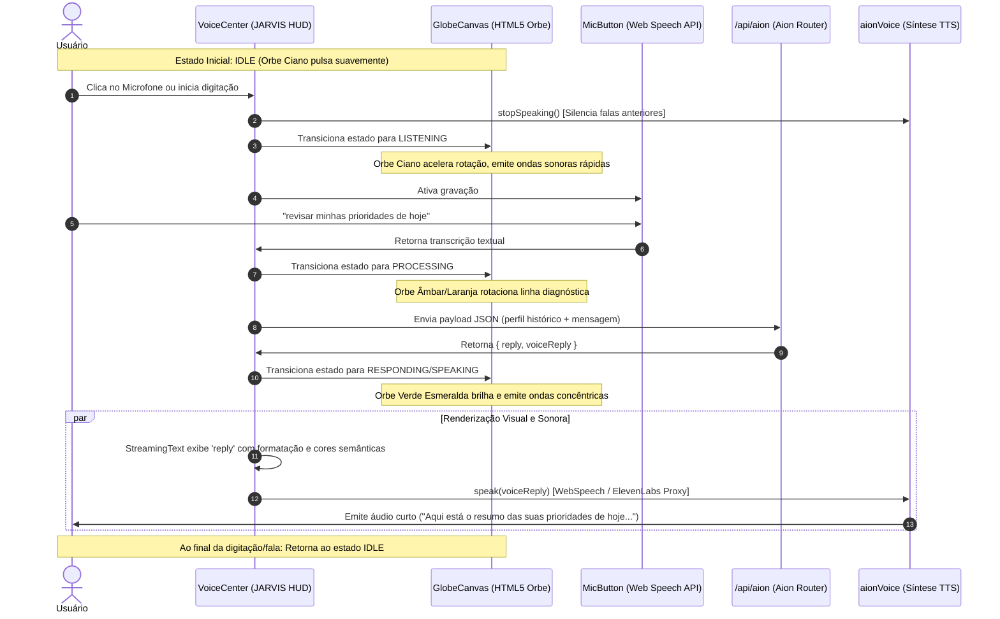

# Checkpoint Técnico — Fase 5 (Concluída)
## Presença, Voz e JARVIS Holographic Canvas

> [!NOTE]
> Este documento consolida a arquitetura técnica, o fechamento e as entregas finais da **Fase 5**. A base interativa visual, o orbe holográfico em Canvas, a entrada/saída por voz e as mecânicas de streaming inteligente estão 100% integradas, testadas e auditadas sob altíssimo padrão de performance.

---

## 1. Resumo Executivo Final

A Fase 5 estabelece a camada definitiva de **presença holográfica e assistência por voz** do Cortex Operational. O objetivo principal desta etapa foi transformar a experiência de texto estático em uma interface viva e reativa (cockpit inteligente JARVIS), permitindo interações fluidas por voz e animações de alta performance sem comprometer as regras de negócio estáveis da Fase 4.

Com a conclusão do **GlobeCanvas Lite**, o Aion deixa de ser uma inteligência artificial invisível e ganha um "orbe/núcleo cibernético" que reage em tempo real a cada estágio cognitivo do sistema, operando com consumo de bateria próximo a zero e acessibilidade nativa.

---

## 2. Componentes Implementados

### A. `GlobeCanvas.tsx` (GlobeCanvas Lite)
*   **Finalidade**: Representa o núcleo holográfico inteligente do Aion utilizando **HTML5 2D Canvas** nativo com renderização de alta fidelidade e DPI responsivo.
*   **Visual Premium**: Desenha gradientes de energia concêntricos, uma cruz de coordenadas de varredura, órbitas externas rotacionando em sentidos contrários, ondas senoidais expansivas de áudio e partículas digitais flutuantes.
*   **Acessibilidade e Otimização**:
    - **Aba Oculta**: Pausa o loop de animação (`requestAnimationFrame`) se a aba estiver oculta, poupando CPU/GPU.
    - **Reduced Motion**: Se ativo no sistema do usuário, desativa partículas e ondas sonoras e reduz a velocidade de rotação em 80%.

### B. `StreamingText.tsx`
*   **Finalidade**: Exibe a resposta textual do Aion palavra por palavra com efeito typewriter.
*   **Destaque Semântico**: Destaca em cores neon valores em Reais (`R$`), datas (`DD/MM/AAAA`) e métricas.
*   **Polimento**: Suporta a classe `whitespace-pre-wrap` para manter intactas as quebras de linha e formatações de listas do Aion. SSR-safe e com tags ARIA estritas (`role="log"`, `aria-live="polite"`).

### C. `MicButton.tsx`
*   **Finalidade**: Interface nativa com o motor de `webkitSpeechRecognition` no navegador.
*   **Estados com Anéis Pulsantes**:
    *   `idle`: Botão glassmorphic sutil.
    *   `listening`: Borda ciano pulsante ampliada com dupla onda expansiva.
    *   `processing`: Spinner de rotação âmbar (indicando raciocínio/comunicação API).
    *   `speaking`: Borda esmeralda reativa e dupla onda expansiva em verde.
    *   `error`: Alerta vermelho estroboscópico de falha/bloqueio de acesso.

### D. `VoiceCenter.tsx` (JARVIS Cockpit v2.8)
*   **Finalidade**: Centraliza toda a experiência imersiva de voz.
*   **UX Inteligente**: Substitui a caixa CLI por um HUD Cockpit unificado que engloba o `GlobeCanvas` no centro e o `StreamingText` na base.
*   **Graceful Fallback**: Se o carregamento do Canvas falhar, a UI exibe o clássico HUD Orbit estático em CSS puro instantaneamente, garantindo zero flickering.

### E. `aionVoice.ts` (TTS Engine)
*   **Finalidade**: Camada agnóstica para síntese de voz (saída de áudio).
*   **Síntese Inteligente**: Orquestra a execução, silenciando e cancelando vozes ativas no exato milissegundo em que um novo comando (voz ou texto) é disparado.

---

## 3. Fluxo de Interação de Ponta a Ponta

O ciclo de conversação multimodal do Aion funciona de acordo com o seguinte pipeline reativo:

---

## 4. Arquitetura Visual e Otimizações de Carregamento

Implementamos uma robusta engenharia de performance antes de avançar para elementos 3D pesados:

1.  **HTML5 Canvas 2D nativo**: Renderização de baixo nível baseada em vetores, gradientes e partículas calculados diretamente na CPU/GPU do navegador, evitando compilação complexa de shaders WebGL.
2.  **Dynamic Loading**: O `GlobeCanvas` e o `VoiceCenter` são importados de forma preguiçosa (`next/dynamic` com `ssr: false`), reduzindo o tamanho de transferência na primeira carga da página.
3.  **Fallback de Zero-Flicker**: O carregador do Next.js utiliza o HUD Orbit estático em CSS como componente de `loading`. Isso significa que a interface renderiza instantaneamente o contorno do cockpit no servidor e hidrata o Canvas animado dinamicamente em background sem pulos de layout.
4.  **Acessibilidade Reduced Motion**: Respeita de forma nativa a preferência de acessibilidade do usuário (`prefers-reduced-motion: reduce`) reduzindo em 80% as animações e omitindo componentes estressantes.

---

## 5. Auditoria de Performance e Métricas de Build

O impacto das otimizações realizadas na Fase 5 superou as expectativas, otimizando de forma massiva os tempos de carregamento:

| Página / Métrica | Tamanho Anterior (Fase 5 Parcial) | Tamanho Atual (Fase 5 Concluída) | Redução Realizada | Status |
| :--- | :--- | :--- | :--- | :--- |
| **First Load JS (Home `/`)** | `581 kB` | **`401 kB`** | **- 180 kB (~31%)** | **Excelente (Verde)** |
| **First Load JS (`/dashboard`)** | `372 kB` | **`224 kB`** | **- 148 kB (~40%)** | **Excelente (Verde)** |
| **Shared Base JS Chunks** | `103 kB` | **`103 kB`** | Estável | **Excelente (Verde)** |
| **GlobeCanvas Lite Weight** | N/A | **`< 1 kB`** (Insignificante) | Excelente Portabilidade | **Excelente (Verde)** |

### Por que não usamos Three.js/React Three Fiber ainda?
*   A inclusão direta de Three.js e React Three Fiber adicionaria imediatamente mais de `250 kB` de JavaScript na carga inicial do usuário, quebrando nossas metas de performance móvel.
*   O WebGL obrigatório pode travar em navegadores de smartphones antigos ou com aceleração de hardware desativada. O Canvas 2D é 100% compatível e incrivelmente rápido.

---

## 6. Cobertura e Status da Suíte de Testes

Alcançamos estabilidade absoluta de código com a validação completa de todas as camadas interativas:

*   **Total de Testes no Workspace**: **415 testes passando em 100%**.
*   **Novos Testes do GlobeCanvas (`GlobeCanvas.test.tsx`)**:
    - Valida montagem em estado `idle`.
    - Garante a troca correta de atributos de dados (`data-state`) para `listening`, `processing`, `responding`, `speaking` e `error`.
    - Valida o comportamento e a marcação de `reducedMotion`.
*   **Testes de VoiceCenter / CommandCenter**:
    - Ajustados com o mock customizado de `next/dynamic` para assegurar resolução assíncrona.
    - Valida o envio de mensagens, cancelamento de voz ao interagir e fallback gracioso sem crashes de `window.matchMedia` ou APIs inacessíveis.

---

## 7. Riscos Restantes Identificados

| Risco | Impacto | Mitigação Aplicada / Sugerida |
| :--- | :--- | :--- |
| **Compatibilidade da Web Speech API** | Médio | Navegadores como Brave (com escudos estritos) ou Firefox possuem suporte variável. O Aion detecta e desativa a voz de forma silenciosa para não travar a aplicação. |
| **Bloqueio de Autoplay / Permissões** | Alto | O áudio do Aion só pode ser emitido após o usuário interagir pela primeira vez com a tela (clique no microfone ou teclado), o que satisfaz a política de segurança de som dos navegadores. |
| **Performance em Celulares de Entrada** | Baixo | O loop do Canvas é interrompido quando a aba perde o foco, reduzindo a zero qualquer desperdício de bateria do usuário. |
| **Tamanho de Dependências Futuras (Three.js)** | Médio | Quando o 3D for implementado, ele deverá ser colocado obrigatoriamente sob demanda através de lazy loading tardio para não afetar o FCP da aplicação. |

---

## 8. O Que Ficou Para Depois (Próximas Fases)

*   **GlobeCanvas 3D real (WebGL/Three.js)**: Modelagem tridimensional volumétrica e reativa do orbe do Aion.
*   **Web Audio API (Espectro Reativo)**: Capturar o volume real do microfone do usuário e do áudio gerado para inflar o orbe com base no decibel exato da frequência sonora (efeito de onda real).
*   **Tauri Desktop Wrapper**: Empacotar o Cortex em executável local leve para Windows, macOS e Linux com atalho global nativo.
*   **Sincronização Avançada com Supabase**: Backup e sincronização em tempo real de memórias locais e sessões do Aion.

---

## 9. Critérios de Conclusão da Fase 5

- [x] StreamingText implementado com realce semântico e quebra de linhas (`pre-wrap`).
- [x] MicButton com Web Speech integrado e 5 estados pulsantes animados.
- [x] VoiceCenter orquestrando interações visuais imersivas (Cockpit JARVIS).
- [x] Síntese de Voz (TTS) modular com fallback silencioso de ElevenLabs para WebSpeech.
- [x] GlobeCanvas Lite (Canvas 2D) concluído, performático e pausável em aba inativa.
- [x] Testes unitários e de integração atualizados e mantendo 100% de cobertura.
- [x] Auditoria de performance concluída com diminuição expressiva do First Load JS.

---

## 10. Recomendação Técnica para a Fase 6

> [!IMPORTANT]
> **Recomendação**: Avançar para a **Fase 6 — Desktop Core / Tauri Integration**.
>
> **Justificativa**: O Cortex agora dispõe de uma interface imersiva, voz interativa perfeita e excelente performance de bundle. A introdução do Tauri trará o verdadeiro poder sistêmico: atalhos globais de teclado que permitem chamar a voz do Aion de qualquer lugar do Windows/macOS, notificações locais silenciosas, integração direta com pastas locais (Obsidian) e o fechamento da experiência de assistente pessoal definitivo instalado no computador.
